# Create an insight application with APEX

## Introduction

Oracle APEX is a low-code development platform that enables you to build scalable, secure enterprise apps, with world-class features, that can be deployed anywhere. Using APEX, developers can quickly develop and deploy compelling apps that solve real problems and provide immediate value. You won't need to be an expert in a vast array of technologies to deliver sophisticated solutions. Focus on solving the problem and let APEX take care of the rest.

In this Lab we are going to use APEX to visualize the result from all the labs.

Estimated Lab Time: 15 minutes.

### Objectives

In this lab, you will:

* Create an APEX application
* Create simple charts 
* Modify a chart

### Prerequisites

This lab assumes you have done all the other labs.

## Task 1: Create Workspace

1. Let's create a new workspace in APEX before we create an application. In your Autonomous Database, go to **Tools** and then **Oracle APEX**.

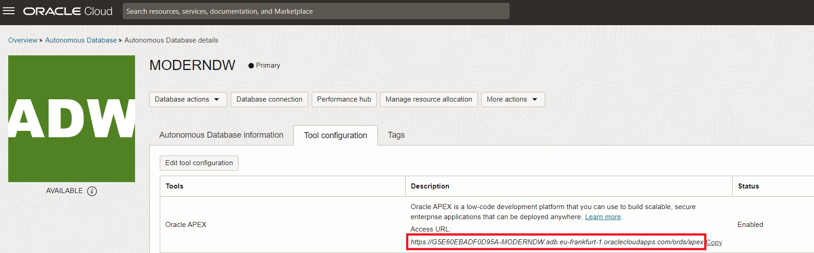

2. We need to log in with the admin user. We just need to introduce the password. 

    - **Password:** Password123##

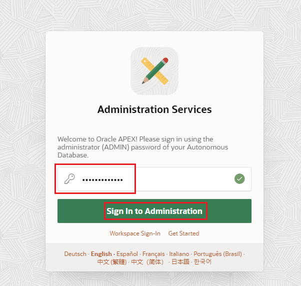

3. Click on **Create Workspace**

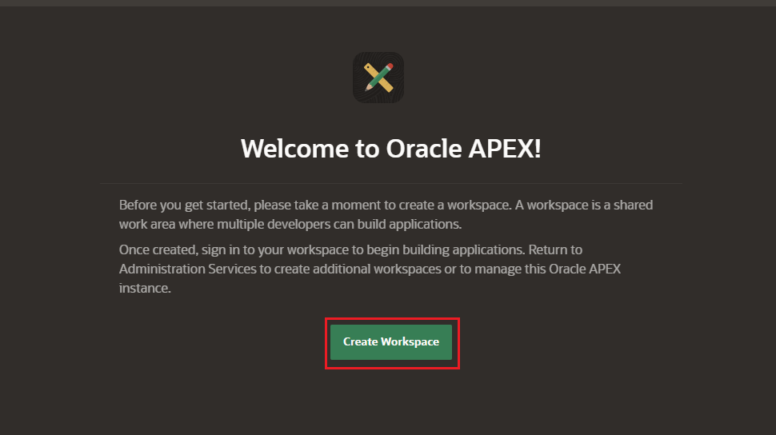

4. Click on **Existing Schema**

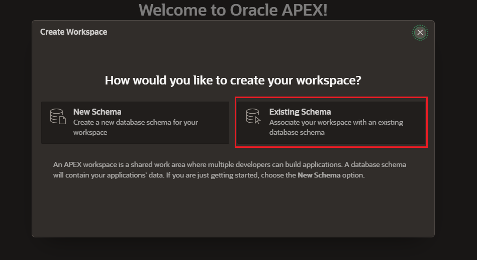

5. Define the user and worskpace. Then click on Create Workspace

    - **Database User:** CNVG

    - **Workspace Name:** CNVG

    - **Workspace Username:** CNVG

    - **Password:** Password123##

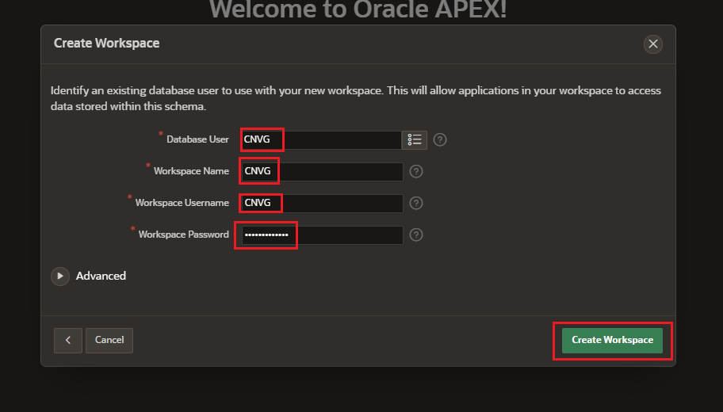

6. Click over **CNVG** to go to the new workspace.

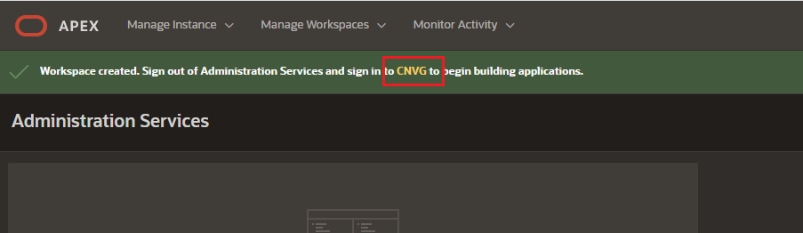

7. Sign in with the CNVG user:

    - **Workspace:** CNVG

    - **Workspace Username:** CNVG

    - **Password:** Password123##

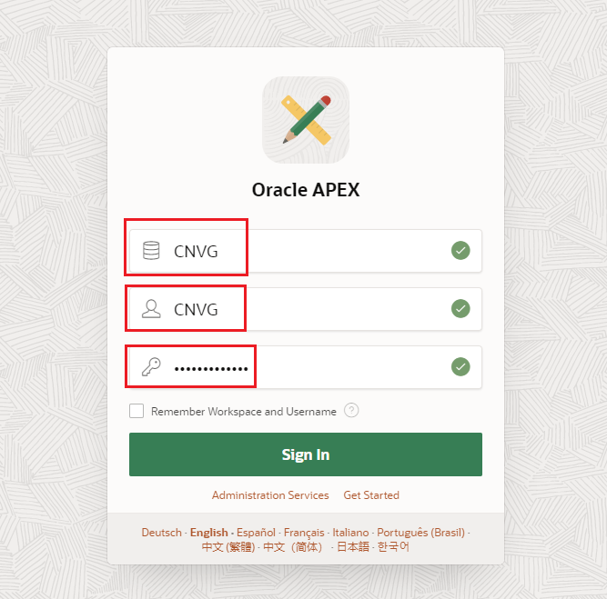

## Task 2: Create an application with charts

1. Let's create our application. Go to **App Builder** and click on **Create**.

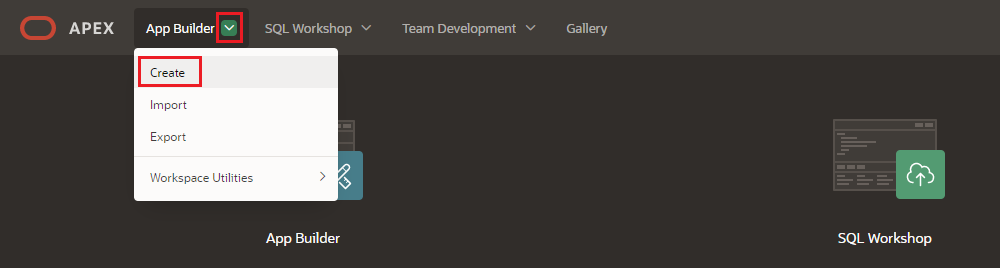

2. Select **New Application** 

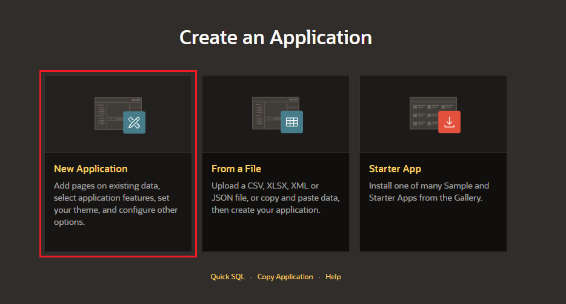

3. Let's define the name for our application. Let's call it Data Insights

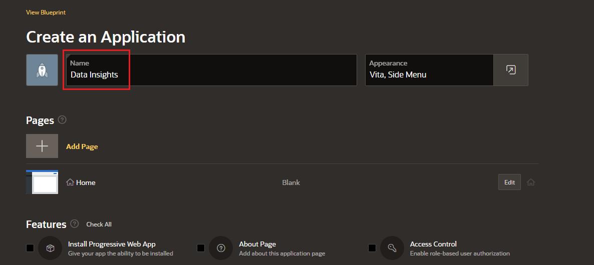

4. Let's add a page to our application. Click on **Add Page**

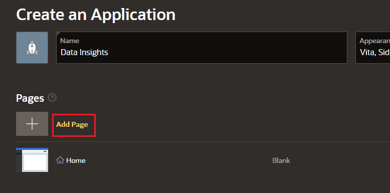

5. Click on **Dashboard**

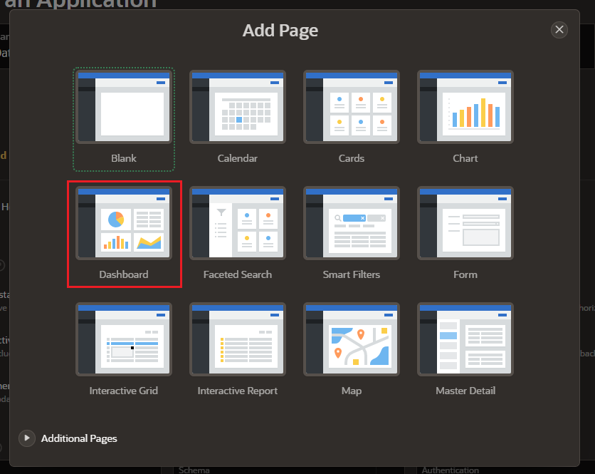

6. This dashboard will populate 4 charts. We just need to define what we want to plot. Let's define our first chart.

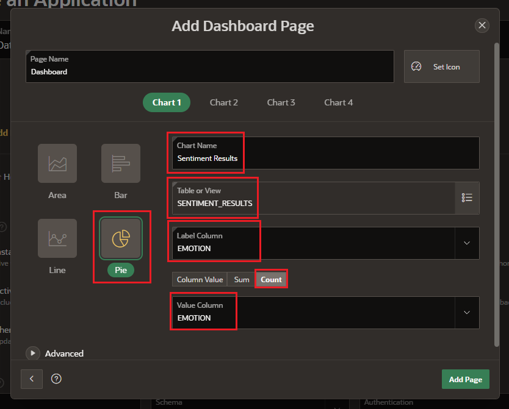

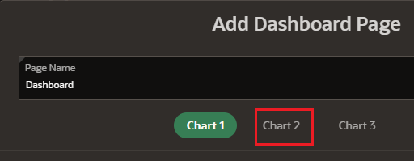

7. Let's populate our second chart.

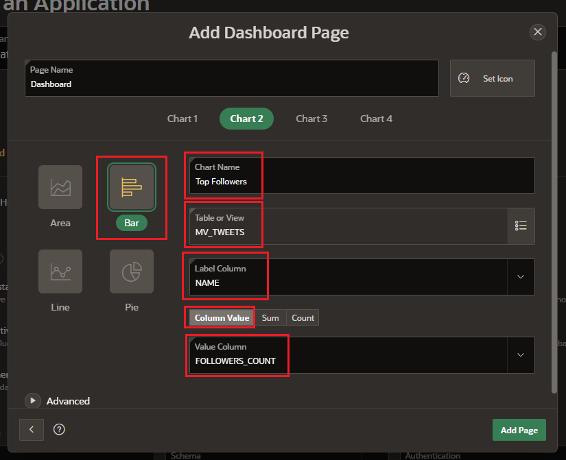

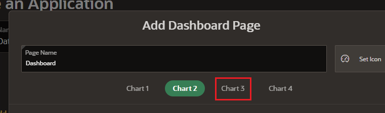

8. Let's populate our third chart

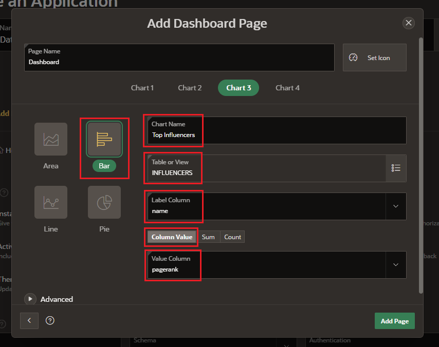

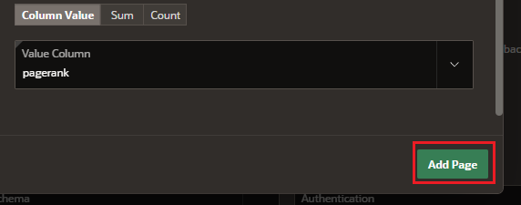

9. Select check all and click on create app.

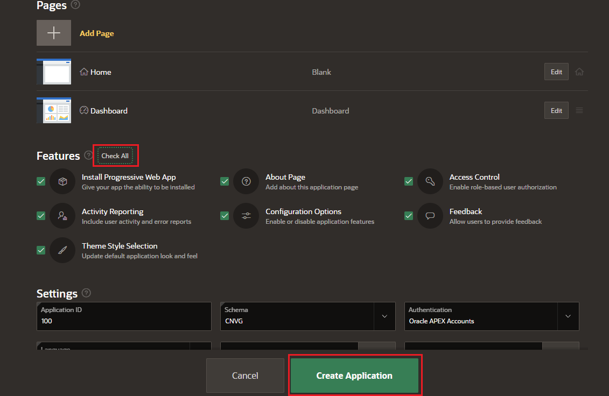

10. Let's have first look into our application. Click on the **Run** button.

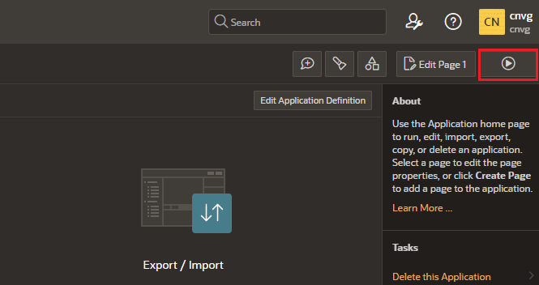

11. Log in with the CNVG user. Then click on Sign in

    - **Username:** CNVG

    - **Password:** Password123##

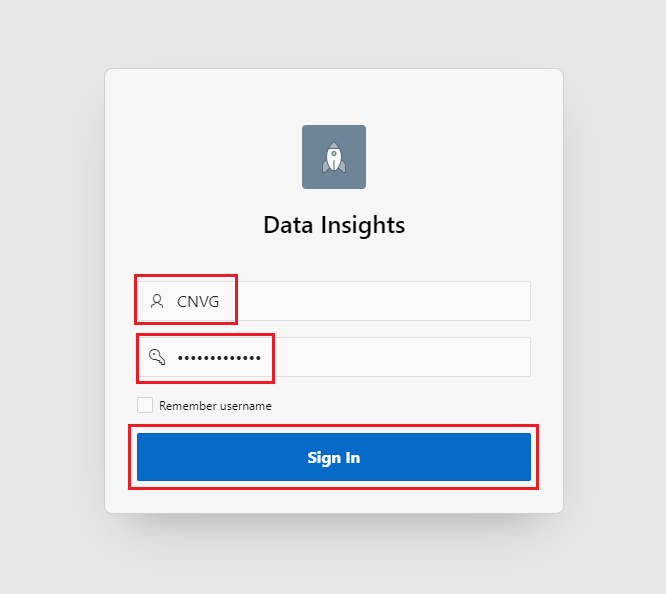

12. Click on Dashboard

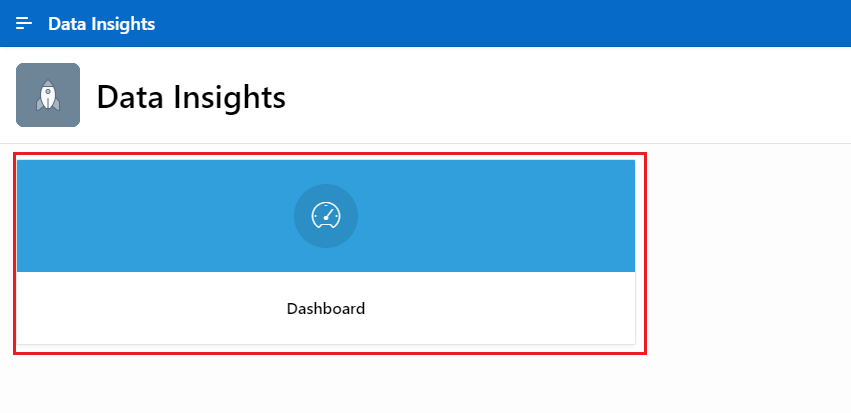

13. We can see our insight application with the reports.

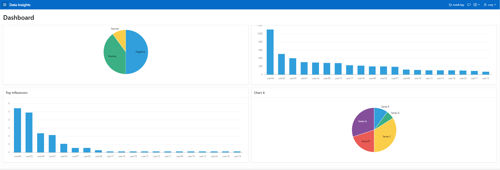

As you can see, we haven't defined the fourth chart. Let's modify that chart in the next task.

## Task 3: Modify a chart

1. Let's modify the last chart. We need to go back to the Application Builder tab, and click on the dashboard page.

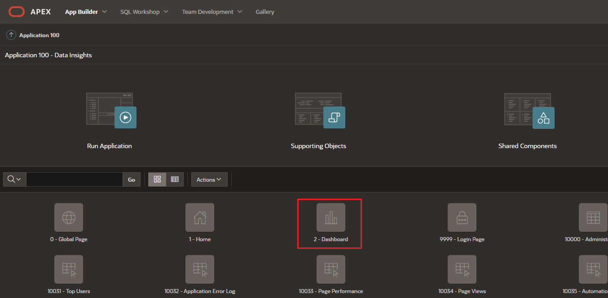

## Acknowledgements
* **Author** - Priscila Iruela, Technology Product Strategy Director
* **Contributors** - Victor Martin Alvarez, Technology Product Strategy Director
* **Last Updated By/Date** - Priscila Iruela, September 2022

## Need Help?
Please submit feedback or ask for help using our [LiveLabs Support Forum](https://community.oracle.com/tech/developers/categories/livelabsdiscussions). Please click the **Log In** button and login using your Oracle Account. Click the **Ask A Question** button to the left to start a *New Discussion* or *Ask a Question*.  Please include your workshop name and lab name.  You can also include screenshots and attach files.  Engage directly with the author of the workshop.

If you do not have an Oracle Account, click [here](https://profile.oracle.com/myprofile/account/create-account.jspx) to create one.