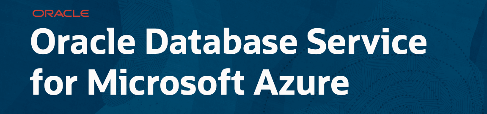

# Oracle Database Service for Microsoft Azure Workshop

## Introduction

The New Oracle Database Service for Microsoft Azure (ODSA) allows you to easily integrate Oracle Cloud Infrastructure's Database service into your Azure cloud environment. ODSA uses a service-based approach, and is an alternative to manually creating complex cross-cloud deployments for your application stacks.

Oracle Database Service for Microsoft Azure is an Oracle-managed service for Azure customers to easily provision, access, and operate enterprise-grade Oracle Database services in Oracle Cloud Infrastructure (OCI) with a familiar Azure-like experience. Users can seamlessly build Azure applications with the high performance, high availability, and automated management of Oracle Database services, such as Autonomous Database, running on OCI.

The service establishes low-latency connectivity between Microsoft Azure and OCI, deploys Oracle Database on OCI, and provides metrics on Azure. Customers can combine the full Azure catalog of AI and application services with OCI’s most powerful database services. There are no charges for the interconnect ports or data ingress/egress over the interconnect. You will be billed normally for consumption of Oracle Database services like Autonomous Database.

- **Run your workloads where you choose**. Choose the best cloud provider for your applications and databases. Run mission-critical enterprise workloads across OCI and Microsoft Azure.

- **Build with Oracle on Azure**. Build new applications by combining Azure services with the high performance, high availability, and automated management of Oracle Database services on OCI.

- **Use fully managed Oracle databases**. Quickly and easily use Azure applications with highly available Oracle autonomous databases that provision, tune, secure, and scale.

- **OCI-exclusive database capabilities**. Use Oracle's Autonomous Database, Exadata Database Service, and Base Database Service with Real Application Clusters and other exclusive OCI capabilities.

This workshop has the following parts:

- Introduction
- Getting Started
- Account Set Up
- Oracle Autonomous Database Provisioning
- Overview and Tags
- Networking
- Backups

**Estimated Workshop Time: 60 minutes.**

## Objectives

In this lab, you will:

* Access to Microsoft Azure Portal
* Sync the Microsoft Azure account with Oracle Cloud Infrastructure
* Provision Oracle Autonomous Database
* Learn Overview and Tags dashboard
* Learn Networking dashboard
* Learn Backups dashboard

## Prerequisites

* [An Oracle Free Tier](https://bit.ly/free-tier-1207), Always Free, Paid or LiveLabs Cloud Account - You can check Getting Started section for more information.
* Microsoft Azure account

Here is a video to help with the Oracle Trial Sign Up Process:

We are providing a basic reference to create a Microsoft Azure account. We are not pretending to be an Microsoft Azure experts or provide Azure best practices. We are using Azure account as user for the workshop purpose not experts level on the matter. If you need support on this process, contact your Microsft Azure support contact.

Here you have a [Prerequisites document](https://objectstorage.eu-frankfurt-1.oraclecloud.com/p/Xs62xuw9UF7_P0By0FfkukpJhbDjzqC68huTdByF0KRPrsnzzLqFqP6H_YxDOJ1m/n/fruktknlrefu/b/workshop-odsa/o/Oracle%20Database%20Service%20for%20Microsoft%20Azure%20Workshop%20-%20Prerequisites.pdf) where you can find support to create the Oracle Cloud account and Microsoft Azure account.

*At this point, you are ready to start learning! Please proceed.*

## Acknowledgements
* **Author** - Priscila Iruela, Technology Product Strategy Director
* **Contributors** - Victor Martin Alvarez, Technology Product Strategy Director
* **Last Updated By/Date** - Priscila Iruela, September 2022

## Need Help?
Please submit feedback or ask for help using our [LiveLabs Support Forum](https://community.oracle.com/tech/developers/categories/livelabsdiscussions). Please click the **Log In** button and login using your Oracle Account. Click the **Ask A Question** button to the left to start a *New Discussion* or *Ask a Question*.  Please include your workshop name and lab name.  You can also include screenshots and attach files.  Engage directly with the author of the workshop.

If you do not have an Oracle Account, click [here](https://profile.oracle.com/myprofile/account/create-account.jspx) to create one.