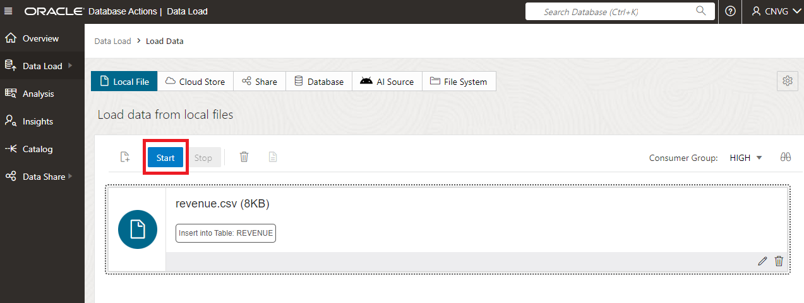

# Load Transactional Data on Blockchain Table

## Introduction

Blockchain tables are append-only tables in which only insert operations are allowed. Deleting rows is either prohibited or restricted based on time. Rows in a blockchain table are made tamper-resistant by special sequencing and chaining algorithms. Users can verify that rows have not been tampered. A hash value that is part of the row metadata is used to chain and validate rows.

In this Lab you will use Blockchain Tables to store transactional data to ensure data has not been any data tampering.

Estimated Lab Time: 15 minutes.

### Objectives

In this lab, you will:

* Create a Blockchain Table
* Load Data into Blockchain table
* Learn about Blockchain table characteristics
* Validate a Blockchain table

### Prerequisites

This lab assumes you have created the Autonomous Data Warehouse database in the previous lab.

## Task 1: Create Blockchain Table

1. Before start the exercise you need to **Download the Data**. Download the CSV dataset from the following [LINK](https://objectstorage.eu-frankfurt-1.oraclecloud.com/n/fro8fl9kuqli/b/json_data/o/revenue.csv)

1. Let's create the Blockchain table. For that we need go go to SQL. We can find it in Database Actions.

    

2. Select SQL. Remember, validate we are the **CNVG** user and not the ADMIN user.

    

3. Copy the following create table statement, which contains the blockchain table:

        <copy> CREATE BLOCKCHAIN TABLE REVENUE
            (    "SHIPTO_ADDR_KEY" NUMBER, 
            "OFFICE_KEY" NUMBER, 
            "EMPL_KEY" NUMBER, 
            "PROD_KEY" NUMBER, 
            "ORDER_KEY" NUMBER, 
            "UNITS" NUMBER, 
            "DISCNT_VALUE" NUMBER, 
            "BILL_MTH_KEY" NUMBER, 
            "BILL_QTR_KEY" NUMBER, 
            "BILL_DAY_DT" TIMESTAMP (6), 
            "ORDER_DAY_DT" TIMESTAMP (6), 
            "PAID_DAY_DT" TIMESTAMP (6), 
            "DISCNT_RATE" NUMBER, 
            "ORDER_STATUS" VARCHAR2(64 BYTE) , 
            "CURRENCY" VARCHAR2(64 BYTE) , 
            "ORDER_TYPE" VARCHAR2(64 BYTE) , 
            "SHIP_DAY_DT" TIMESTAMP (6), 
            "COST_FIXED" NUMBER, 
            "COST_VARIABLE" NUMBER, 
            "SRC_ORDER_NUMBER" VARCHAR2(32767 BYTE) , 
            "ORDER_NUMBER" NUMBER, 
            "REVENUE" NUMBER, 
            "ORDER_DTIME2_TIMEZONE" VARCHAR2(64 BYTE) , 
            "AFFINITY_CARD" NUMBER, 
            "ALREADY_BAD_COMMENTS" NUMBER, 
            "CUST_KEY" VARCHAR2(64 BYTE) 
            )  
            NO DROP UNTIL 16 DAYS IDLE
            NO DELETE LOCKED
            HASHING USING "SHA2_512" VERSION "v1";

        </copy>

4. Pase it over SQL, and click on run.

    

## Task 2: Load data into Blockchain table

1. Let's load the data, select the **Data Load** from the menu.

    

2. We are going to upload our local file. Select this option and click next.

    

3. Select our revenue.csv file.

    

4. Once it is selected, we are going to define into which table we want to load. Click on the **edit** button.

    

5. Modify the table insert. Once it is modified, you can click close.

    - **Option:** Insert into table
    
    - **Name:** Revenue

    

6. Now you can click on **run** to load the data into the blockchain table.

    

    

7. You should see no error when loading

    

## Task 3: Try to do data tampering

1. Now that we have the data loaded, let's go to SQL to run some queries.

    

2. Let's have a look into the new revenue data. You will see information about many transactions.

        <copy> 
            select * from revenue
        </copy>

    

3. We can have a look to see how many rows do we have

        <copy> 
            select count(*)  from revenue
        </copy>
        
    

4. We can easily identify how many Blockchain tables we have in our schema.

        <copy> 
            select * from user_blockchain_tables
        </copy>
        
    

5. Blockchain tables has some hidden columns. They are used to implement sequencing of rows and verify that data is tamper-resistant. Hidden columns can only be displayed by explicitly including the column names in the query.

        <copy> 
            SELECT table_name, internal_column_id ,column_name, data_type, data_length 
            FROM user_tab_cols
            where table_name='REVENUE'
            ORDER BY internal_column_id;

        </copy>
        
    

6. Let's query that hidden columns.

        <copy> 
           select order_key, cust_key,  ORABCTAB_INST_ID$,
            ORABCTAB_CHAIN_ID$, ORABCTAB_SEQ_NUM$,
            ORABCTAB_CREATION_TIME$, ORABCTAB_USER_NUMBER$,
            ORABCTAB_HASH$, ORABCTAB_SIGNATURE$, ORABCTAB_SIGNATURE_ALG$,
            ORABCTAB_SIGNATURE_CERT$ from revenue;
        </copy>
        
    

7. Now that we have all the info about the Blockchain table, let's try to run an update.

        <copy> 
           update revenue set order_key=1 where order_key=2;
        </copy>
        
    

8. Now let's try to drop the table.

        <copy> 
           drop table revenue;
        </copy>
        
    

## Task 4: Validate data

1. Oracle provides a validation procedure to ensure that our data has not been tampered or modified, breaking the blockchain table definition. We can run the following code.

        <copy> 
           declare
           total_rows      number;
           verify_rows NUMBER;
        begin
            select count(*) into total_rows from revenue;
            dbms_blockchain_table.verify_rows('CNVG','REVENUE',number_of_rows_verified => verify_rows);
            dbms_output.put_line(' Total of Rows=' || total_rows || '  Verified Rows=' || verify_rows);
        end;
        </copy>
        
    

## Acknowledgements
* **Author** - Javier de la Torre, Principal Data Mangagement Specialist
* **Contributors** - Priscila Iruela, Technology Product Strategy Director
* **Last Updated By/Date** - Javier de la Torre, Principal Data Mangagement Specialist

## Need Help?
Please submit feedback or ask for help using our [LiveLabs Support Forum](https://community.oracle.com/tech/developers/categories/livelabsdiscussions). Please click the **Log In** button and login using your Oracle Account. Click the **Ask A Question** button to the left to start a *New Discussion* or *Ask a Question*.  Please include your workshop name and lab name.  You can also include screenshots and attach files.  Engage directly with the author of the workshop.

If you do not have an Oracle Account, click [here](https://profile.oracle.com/myprofile/account/create-account.jspx) to create one.