# Identify influencers using Oracle Graph

## Introduction

Oracle Graph allows to discover patterns in the data. We will use the tweets to see how the users talk with each other in order to get more information.

Estimated Lab Time: 30 minutes.

### Objectives

In this lab, you will:

* Create a Graph Server
* Populate a graph
* Use the Page Rank algorithm to find influencers

### Prerequisites

This lab assumes you have created the Autonomous Data Warehouse database and you have loaded the JSON tweets from Lab 2.

## Task 1: Load Friends JSON Data

1. We have a new dataset which has information about twitter's users followers. We are going to use this data to build a graph. First we need to upload this file into the object storage. Go to **storage** and **buckets**

    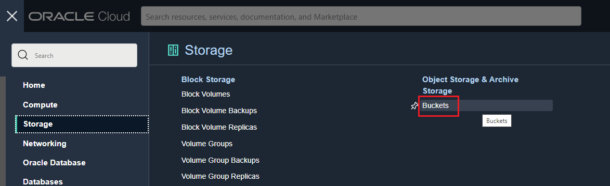

2. Select our **json_data** bucket.

    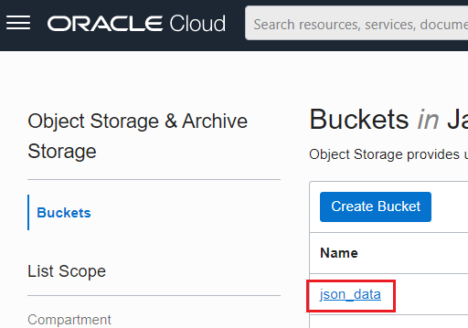

3. Click on **Upload** button.

    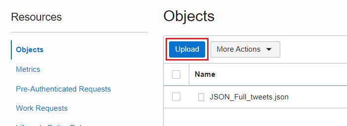

4. Select the friend_of.json and click upload.

    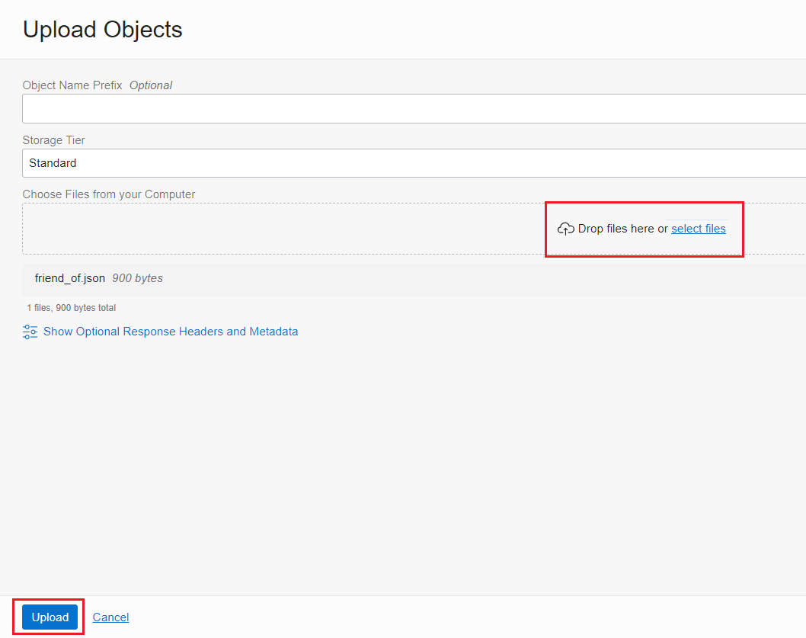

5. Click close.

    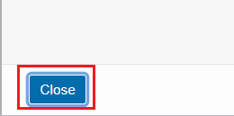

6. Let's get the URL of the JSON Object. We will need it for later.

    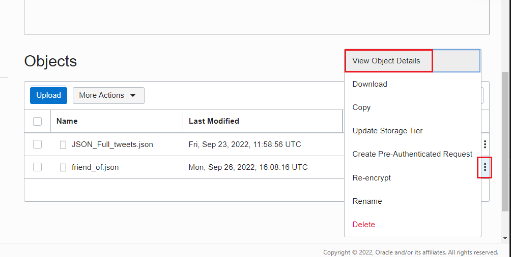

7. **Store** the URL for later usage.

    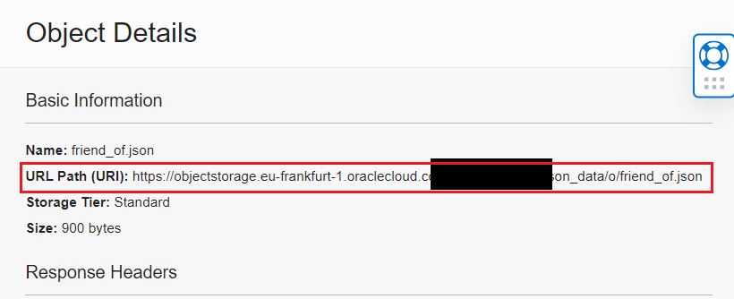

8. We need to go back to JSON. Let's create a new JSON Collection.

    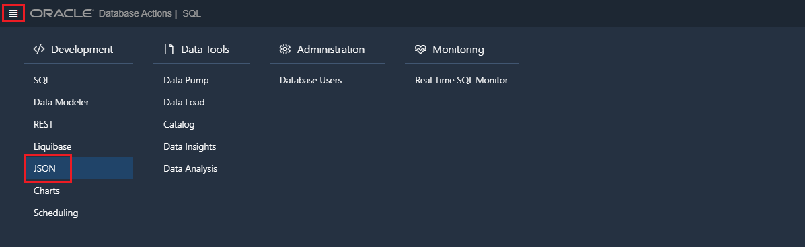

9. Click on create new collection.

    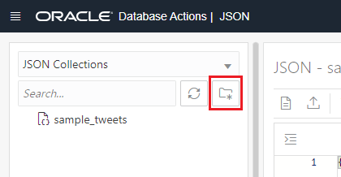

10. Set the new name for the collection as **friend_of** and click **create**.

    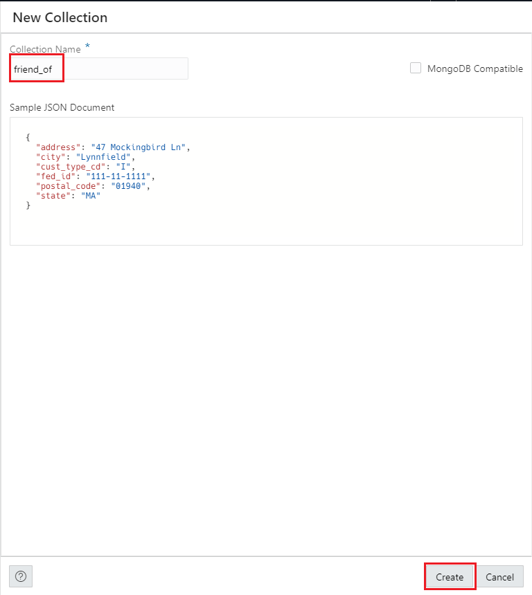

11. Go back to SQL, for loading the data.

    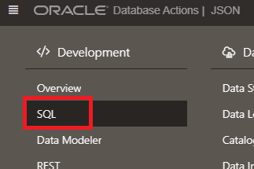

12. Load the JSON using the COPY_COLLECTION utility.

        <copy> BEGIN 
            DBMS_CLOUD.COPY_COLLECTION(    
            collection_name => 'friend_of', 
            credential_name=>'json_cred',   
            file_uri_list => 'YOUR_URL',
            format => '{"recorddelimiter" : "0x''01''", "unpackarrays" : "TRUE", "maxdocsize" : "10240000"}'
            );
            END;
            /
        </copy>

    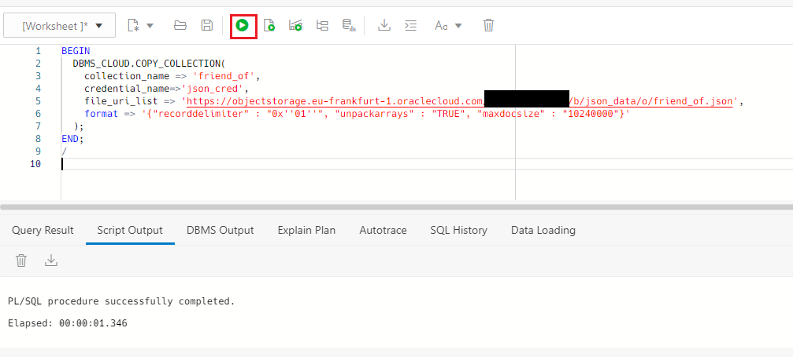

## Task 2: Create a VCN for the Graph Server

1. We need to create a Virtual Cloud Network (VCN) before we provision the Graph Server. Go to Networking and then Virtual Cloud Network.

    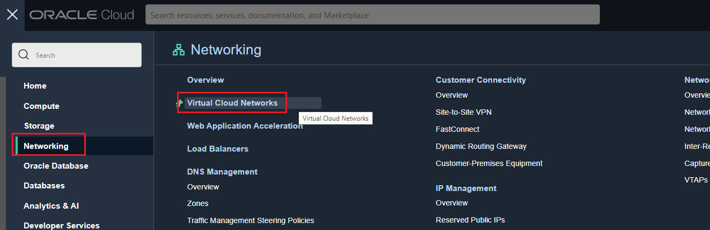

2. Click on **Start VCN Wizard**

    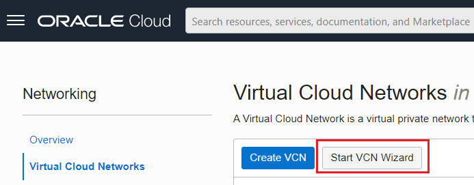

3. Select **Create VCN with Internet Connectivity** and click on **Start VCN Wizard**

    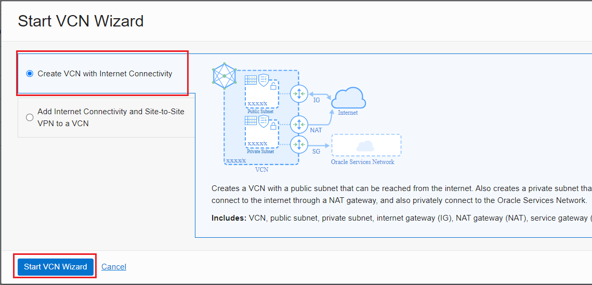

4. Define the VCN Name as **vcn_graph**. Then click on **Next**.

    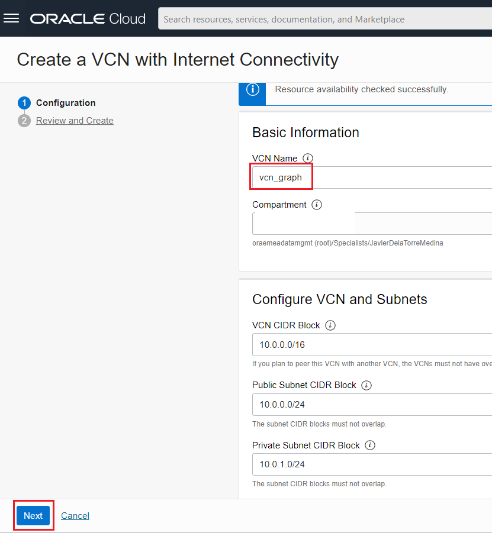

5. Keep the default configuration. Click on **Create**

    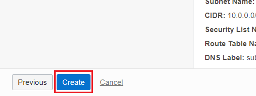

## Task 3: Create Oracle Graph Server

## Task 4: Create a Graph

## Task 5: Find influencers

## Acknowledgements
* **Author** - Priscila Iruela, Technology Product Strategy Director
* **Contributors** - Victor Martin Alvarez, Technology Product Strategy Director
* **Last Updated By/Date** - Priscila Iruela, September 2022

## Need Help?
Please submit feedback or ask for help using our [LiveLabs Support Forum](https://community.oracle.com/tech/developers/categories/livelabsdiscussions). Please click the **Log In** button and login using your Oracle Account. Click the **Ask A Question** button to the left to start a *New Discussion* or *Ask a Question*.  Please include your workshop name and lab name.  You can also include screenshots and attach files.  Engage directly with the author of the workshop.

If you do not have an Oracle Account, click [here](https://profile.oracle.com/myprofile/account/create-account.jspx) to create one.