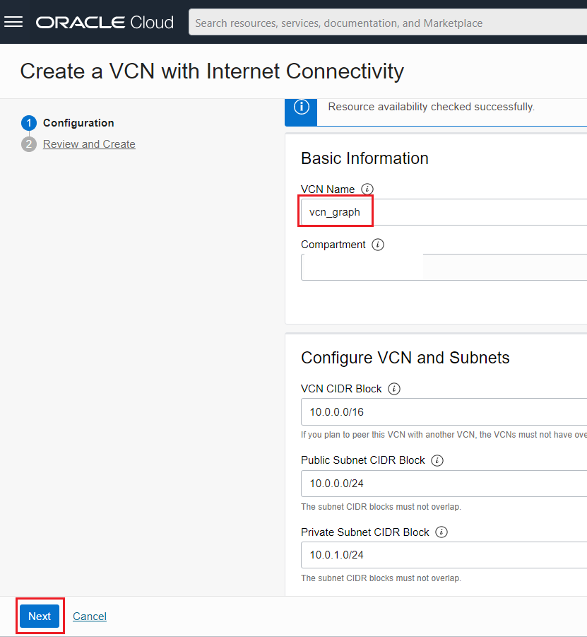
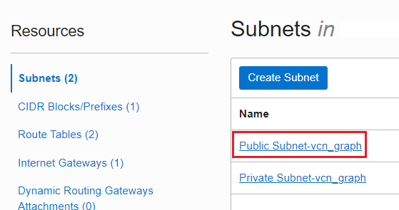
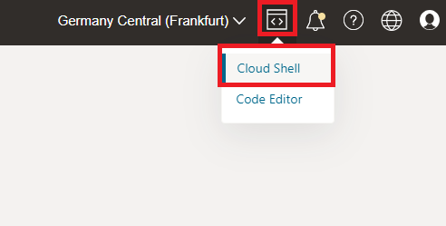
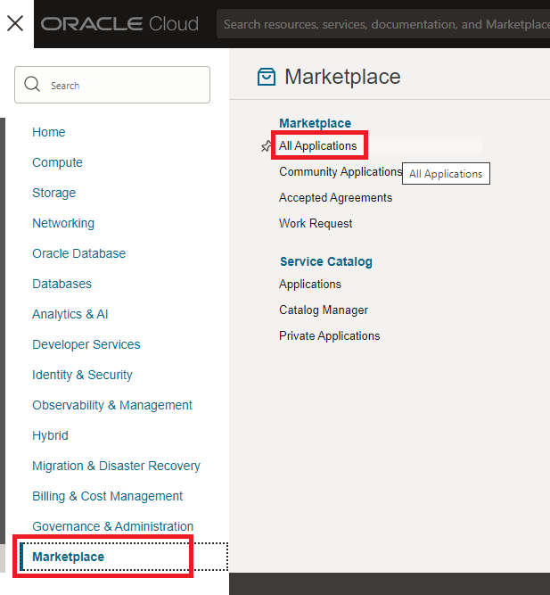
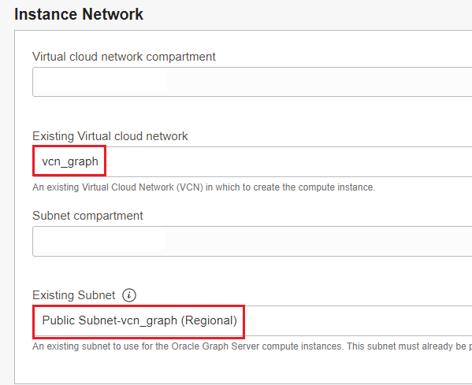
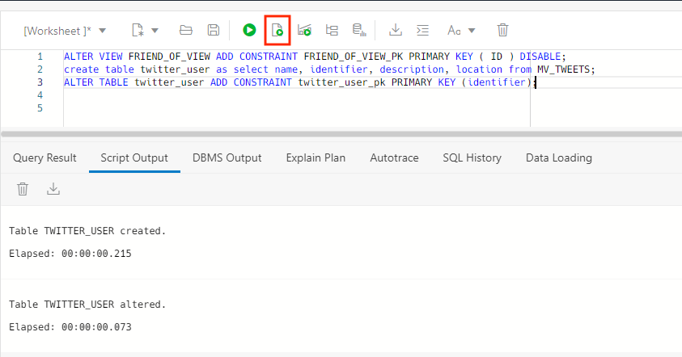

# Identify influencers using Oracle Graph

## Introduction

Oracle Graph allows to discover patterns in the data. We will use the tweets to see how the users talk with each other in order to get more information.

Estimated Lab Time: 30 minutes.

### Objectives

In this lab, you will:

* Create a Graph Server
* Populate a graph
* Use the Page Rank algorithm to find influencers

### Prerequisites

This lab assumes you have created the Autonomous Data Warehouse database and you have loaded the JSON tweets from Lab 2.

## Task 1: Load Friends JSON Data

1. We have a new dataset which has information about twitter's users followers. We are going to use this data to build a graph. First we need to upload this file into the object storage. Go to **storage** and **buckets**

    

2. Select our **json_data** bucket.

    

3. Click on **Upload** button.

    

4. Select the friend_of.json and click upload.

    

5. Click close.

    

6. Let's get the URL of the JSON Object. We will need it for later.

    

7. **Store** the URL for later usage.

    

8. We need to go back to JSON. Let's create a new JSON Collection.

    

9. Click on create new collection.

    

10. Set the new name for the collection as **friend_of** and click **create**.

    

11. Go back to SQL, for loading the data.

    

12. Load the JSON using the COPY_COLLECTION utility.

        <copy> BEGIN 
            DBMS_CLOUD.COPY_COLLECTION(    
            collection_name => 'friend_of', 
            credential_name=>'json_cred',   
            file_uri_list => 'YOUR_URL',
            format => '{"recorddelimiter" : "0x''01''", "unpackarrays" : "TRUE", "maxdocsize" : "10240000"}'
            );
            END;
            /
        </copy>

    

## Task 2: Create a VCN for the Graph Server

1. We need to create a Virtual Cloud Network (VCN) before we provision the Graph Server. Go to Networking and then Virtual Cloud Network.

    

2. Click on **Start VCN Wizard**

    

3. Select **Create VCN with Internet Connectivity** and click on **Start VCN Wizard**

    

4. Define the VCN Name as **vcn_graph**. Then click on **Next**.

    

5. Keep the default configuration. Click on **Create**

    

6. We need to open the port **7007** for the Graph Server. Let's go back to the VCN configuration.

    

7. Select the just created VCN, **vcn_graph**

    

8. Select the public vcn.

    

9. Select the default Security List.

    

10. Click on **Add Ingress Rule**

     

11. Set the following rule for opening the port 7007, then click on **Add Ingress Rules**: 

    - **CIDR:** 0.0.0.0/0
    
    - **IP Protocol:** TCP

    - **Destination Port Range:** 7007

    - **Description:** Graph Server

     

## Task 3: Create Oracle Graph Server

1. Before we create the Graph Server, we need to generate a ssh key. For that we are going to use the cloud shell. 

     

     

2. Once the cloud shell has started, run the following commands to generate a ssh key. Press Enter twice for no passphrase

        <copy> 
            mkdir .ssh
        </copy>

        <copy> 
            cd .ssh
        </copy>

        <copy> 
            ssh-keygen -b 2048 -t rsa -f graphkey
        </copy>

     

3. We will need the public key when creating the Graph Server. In order to get the public key, you can run the following command:

        <copy> 
            cat graphkey.pub
        </copy>

     

4. Now we are ready to provision the Graph Server. We can find it in the marketplace.

     

5. In the marketplace, look for **Graph**. There you can select **Oracle Graph Server and Client**.

    

6. Select that you had reviewed the terms and restrictions and click on **Launch Stack**.

    

7. Leave the default configuration and click **Next**.

    

8. Now configure the Graph Server:

    
    - **Availability Domain:** Choose any available

    - **Shape:** VM.Standard.E2.1

    - **SSH Public Key:** Copy from the cloud shell

    

9. Select the VCN and the **public subnet** we already created.

    

10. Finally we have to define the JDBC connection for our Autonomous Database

        <copy> 
            jdbc:oracle:thin:@moderndw_low?TNS_ADMIN=/etc/oracle/graph/wallets
        </copy>
    

    

11. Click on **Next**.

    

12. Click on **Create**.

    

13. This will create a terraform job for creating this instance.

    

14. You should see it as succeed.

    

15. The Graph connect needs the Autonomous Wallet to connect. We need to download it and upload it into the Graph Server. Go to the Autonomous Database and click on **DB Connection**. 

    

16. Click on Download Wallet.

    

17. Set the same password: **Password123##** and click download.

    

18. Now we are going to upload the wallet to the **Cloud Shell**.

    

19. Select the wallet and click on **Upload**

    

20. We are going to use SCP to move the wallet from the Cloud Shell into the Graph Server. Before we need the IP. Let's find it under compute.

    

21. Copy the Public IP. We are going to need it for the next exercise

    

22. Go back to the Cloud shell. Run the following command to copy the wallet into the Graph Server. Remember to use **YOUR IP**. 

        <copy> 
            scp -i .ssh/graphkey Wallet_MODERNDW.zip opc@YOUR_IP:/etc/oracle/graph/wallets
        </copy>

    
    

23. Now we just need to unzip it on the Graph Server. We need to connect via ssh and unzip it.
        
        <copy> 
            ssh -i .ssh/graphkey opc@YOUR_IP
        cd /etc/oracle/graph/wallets/
        unzip Wallet_MODERNDW.zip
        chgrp oraclegraph *
        </copy>

## Task 4: Create a Graph

1. The Graph Server is created, now we need to populate the Graph. For simplicity, we are going to create a simpler table of twitter users and we are going to create a view on top of the friend_of JSON Collection. Let's create the view first. Go to your Autonomous Database and click on **Database Actions**

    

2. Go to JSON

    

3. Select the **friend_of** collection and click on create view.

    

4. Add **all columns** and click on **Create**

    

5. Go back to sql

    

6. We need a primary for our view. Also we are going to create a simplified table for our twitter users and we are going to create a primary key too.

        <copy> 
            ALTER VIEW FRIEND_OF_VIEW ADD CONSTRAINT FRIEND_OF_VIEW_PK PRIMARY KEY ( ID ) DISABLE;
            create table twitter_user as select name, identifier, description, location from MV_TWEETS;
            ALTER TABLE twitter_user ADD CONSTRAINT twitter_user_pk PRIMARY KEY (identifier);
        </copy>

    

7. Now we can finally create the Graph. Let's go back to our cloud shell to connect to the Graph Server. If you have disconnected you can conenct again via ssh.

        <copy> 
            ssh -i .ssh/graphkey opc@YOUR_IP
        </copy>

8. Let's connect with the **opg4py** utility. We are going to use the **cnvg** user and the password **Password123##**

        <copy> 
            opg4py -b https://localhost:7007 -u cnvg
        </copy>

    

    

9. Let's define the Graph.

        <copy> 
            statement = '''
            CREATE PROPERTY GRAPH "influencer"
            VERTEX TABLES (
            TWITTER_USER
            )
            EDGE TABLES (
            friend_of_view
            SOURCE KEY(user_id) REFERENCES TWITTER_USER
            DESTINATION KEY(is_frend_of) REFERENCES TWITTER_USER
            )
            '''

        </copy>

    

10. Let's execute the definition.

        <copy> 
            session.prepare_pgql(statement).execute()
        </copy>

    

11. Let's store the graph in a variable.

        <copy> 
            graph=session.get_graph("influencer")
        </copy>

    

12. Now let's run a simple query.

        <copy> 
            graph.query_pgql("""
            SELECT a.name,a.description, a.location,b.name as "friend of"
            FROM MATCH (a)-[e]->(b)
            """).print()
        </copy>

    

## Task 5: Find influencers

1. As we have the Graph loaded, let's use the Page Rank ALgorithm to determine influencers in our community.

        <copy> 
            analyst.pagerank(graph)
        </copy>

2. Now let's see the results. Let's run a simple query.

        <copy> 
            graph.query_pgql("""
            SELECT a.name,a.description, a.pagerank
            FROM MATCH (a)
            ORDER BY a.pagerank DESC
            """).print()

        </copy>

    

## Acknowledgements
* **Author** - Priscila Iruela, Technology Product Strategy Director
* **Contributors** - Victor Martin Alvarez, Technology Product Strategy Director
* **Last Updated By/Date** - Priscila Iruela, September 2022

## Need Help?
Please submit feedback or ask for help using our [LiveLabs Support Forum](https://community.oracle.com/tech/developers/categories/livelabsdiscussions). Please click the **Log In** button and login using your Oracle Account. Click the **Ask A Question** button to the left to start a *New Discussion* or *Ask a Question*.  Please include your workshop name and lab name.  You can also include screenshots and attach files.  Engage directly with the author of the workshop.

If you do not have an Oracle Account, click [here](https://profile.oracle.com/myprofile/account/create-account.jspx) to create one.