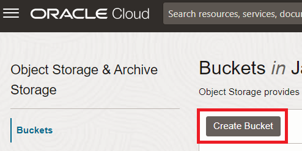

# Load JSON tweets in the Autonomous Database

## Introduction

Autonomous Database supports JSON data natively in the database. You can use NoSQL-style APIs to develop applications that use JSON document collections without needing to know SQL or how the documents are stored in the database.

In this Lab you are going to learn how to upload JSON data and how to run some queries over them.

Estimated Lab Time: 15 minutes.

### Objectives

In this lab, you will:

* Create a Object Storage bucket
* Upload JSON data
* Create Autonomous Credentials
* Query JSON data

### Prerequisites

This lab assumes you have created the Autonomous Data Warehouse database in the previous lab.

## Task 1: Upload JSON tweets into Object Storage

1. Once you have downloaded the JSON containing some tweets, we need to upload them into Object Storage. First we need to create a bucket.

    

2. Click on **Create Bucket**

    

3. Set the name for the bucket. We are going to call it **json_data**. Then click the **create** button.

    

4. Select the **json_data** bucket.

    

5. Click on the **upload** button.

    

6. Select the JSON file we just downloaded and then click on **upload**

    

7. We should see the JSON file there.

    
    

## Task 2: Load JSON into Autonomous Database

## Task 3: Run queries over JSON

## Acknowledgements
* **Author** - Javier de la Torre, Principal Data Mangagement Specialist
* **Contributors** - Priscila Iruela, Technology Product Strategy Director
* **Last Updated By/Date** - Javier de la Torre, Principal Data Mangagement Specialist

## Need Help?
Please submit feedback or ask for help using our [LiveLabs Support Forum](https://community.oracle.com/tech/developers/categories/livelabsdiscussions). Please click the **Log In** button and login using your Oracle Account. Click the **Ask A Question** button to the left to start a *New Discussion* or *Ask a Question*.  Please include your workshop name and lab name.  You can also include screenshots and attach files.  Engage directly with the author of the workshop.

If you do not have an Oracle Account, click [here](https://profile.oracle.com/myprofile/account/create-account.jspx) to create one.