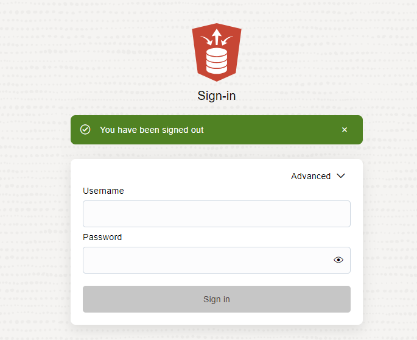
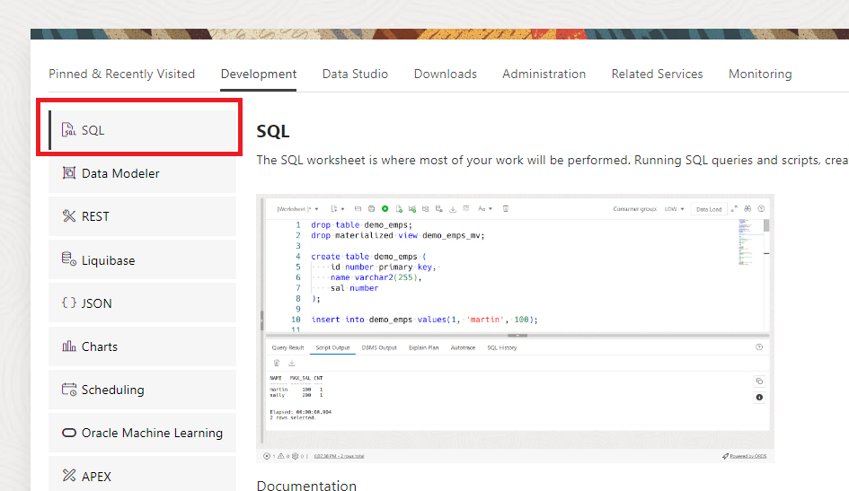
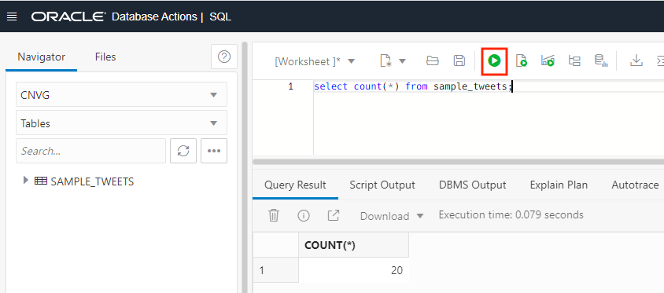
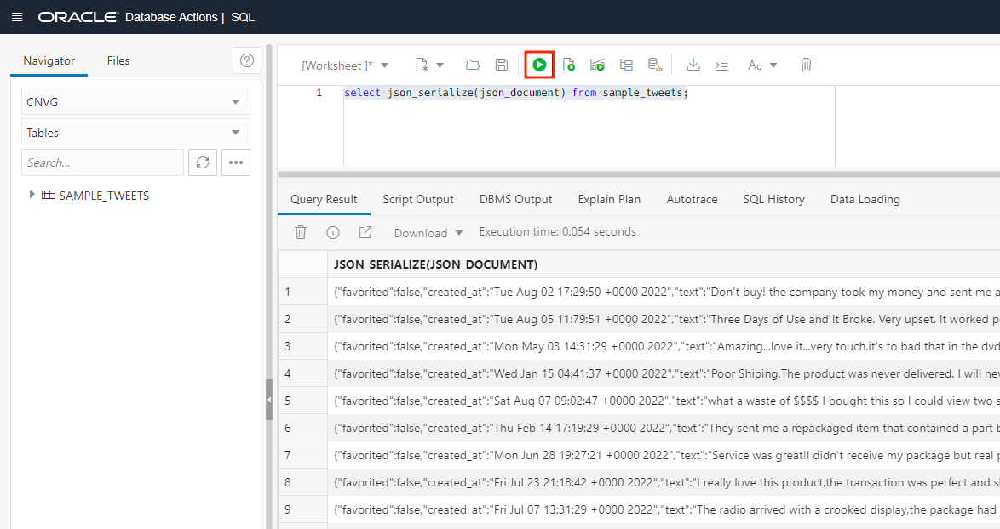
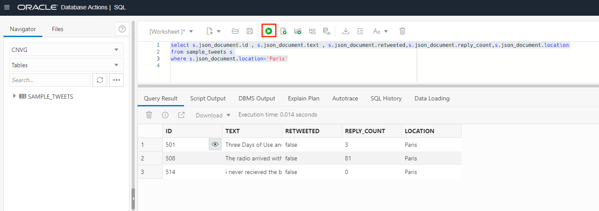
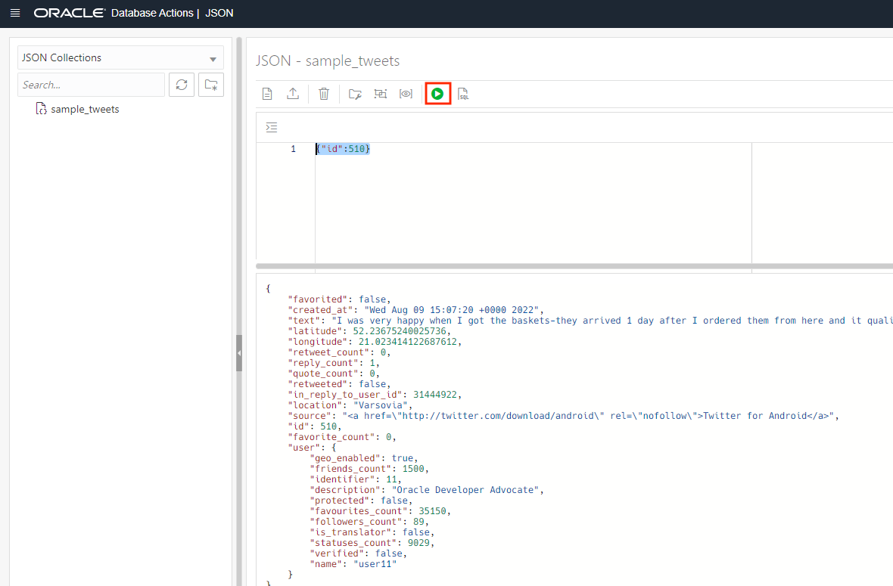

# Load JSON tweets in the Autonomous Database

## Introduction

Autonomous Database supports JSON data natively in the database. You can use NoSQL-style APIs to develop applications that use JSON document collections without needing to know SQL or how the documents are stored in the database.

In this Lab you are going to learn how to upload JSON data and how to run some queries over them.

Estimated Lab Time: 15 minutes.

### Objectives

In this lab, you will:

* Create a Object Storage bucket
* Upload JSON data
* Create Autonomous Credentials
* Query JSON data

### Prerequisites

This lab assumes you have created the Autonomous Data Warehouse database in the previous lab.

## Task 1: Upload JSON tweets into Object Storage

1. Once you have downloaded the JSON containing some tweets, we need to upload them into Object Storage. First we need to create a bucket.

    

2. Click on **Create Bucket**

    

3. Set the name for the bucket. We are going to call it **json_data**. Then click the **create** button.

    

4. Select the **json_data** bucket.

    

5. Click on the **upload** button.

    

6. Select the JSON file we just downloaded and then click on **upload**

    

7. We should see the JSON file there.

    
    

## Task 2: Create credential for Autonomous Database

1. Now we have the tweets available in the Object Storage. Now we need to create a **credential**. This credential willl allow the Autonomous Database to authenticate against the Object Storage Service. Click on your profile icon and then on your email name. **Store** your user as you will need it for later.

    

2. Let's create a new token for the Autonomous Database. Click on **Auth Token**.

    

3. Click on **Generate Token**

    

4. It will show a popup like this. This token will be shown only once. Click **Show** to show the token. **Save it** in a notepad or a secure place for later. It will never be shown again.

    

5. Click **copy** and store it in a secure place. Then you can click **close**.

    

6. We have stored the credential, now we need to find and store the location of where the data is stored. We will share this info with the Autonomous Database so it can load it. Let's go back to the Object Storage.

    

7. Select the JSON bucket we already created.

    

8. Let's find the information from the tweets. From the menu of the file, select **View Object Details**

    

9. You will find the url with the JSON file location. **Save this url** as we are going to need it for loading it. Then click **cancel** to exit.

    

10. As we have the credential created and we know the url where we store our JSON data, now we can proceed to authorize Autonomous with this credential. Let's go to our Autonomous Data Warehouse

    

11. Select our MODERNDW database

    

12. Go to **Database Actions**

    

13. We need to connect with the **CNVG** and not with the ADMIN user. Let's log out first

    

14. Click on **Sign in**.

    

15. Connect with the CNVG user we created before
    - **User Name:** CNVG
    
    - **Password:** Password123##

    

16. Select the SQL Web 

    

17. Run the following SQL for creating the credential:

    
        <copy> begin
            dbms_cloud.create_credential (
            credential_name => 'json_cred',
            username        => 'your_user',
            password        => 'your_key'
            );
            end;
            /
        </copy>
        

    

## Task 3: Load JSON into Autonomous Database

1. In this task we are going to learn how to upload single document and how to load bulk JSONs. First let's learn how to do load a simple document. Go to the menu and select JSON.

    

2. Let's create a new collection to store our JSON data. Click on create collection.

    

3. Name our new collection as **sample_tweets** and click **create**.

    

4. Let's upload a new JSON document. Click on the icon for creating a new one.

    

5. Copy and paste the following tweet. Then click on the **Create** button.

        <copy>{
                "id": 500,
                "text": "Don't buy! the company took my money and sent me an email telling me the product was shipped.Still waiting after a month. Very dissapointed!",
                "favorited": false,
                "created_at": "Tue Aug 02 17:29:50 +0000 2022",  
                "retweet_count": 0,
                "reply_count": 0,
                "quote_count": 0,
                "retweeted": false,
                "location":"Rome",
                "latitude": 41.889214119987905,
                "longitude":12.492245184925652,
                "in_reply_to_user_id": 31444922,
                "source": "<a href=\"http://twitter.com/download/iphone\" rel=\"nofollow\">Twitter for iPhone</a>",
                "favorite_count": 0,
                "user": {
                    "name": "user01",
                    "identifier": 1,
                    "description": "loves cupcakes and cats",
                    "geo_enabled": true,
                    "friends_count": 5000,
                    "protected": false,
                    "favourites_count": 35150,
                    "followers_count": 306,
                    "is_translator": false,
                    "statuses_count": 9029,
                    "verified": false 
                }
                }
        </copy>

    

6. Now let's proceed for the bulk load. Let's load the JSON file stored in the object storage. Let's go back to SQL.

    

7. Execute the COPY_COLLECTION utility for loading the JSON file into the collection. We need to provide the credential created, the collection name and the URL where the JSON is located. You should have all this information from steps before. Run the following code and execute it.

        <copy> BEGIN 
            DBMS_CLOUD.COPY_COLLECTION(    
                collection_name => 'sample_tweets', 
                credential_name=>'json_cred',   
                file_uri_list => 'your_url',
                format => '{"recorddelimiter" : "0x''01''", "unpackarrays" : "TRUE", "maxdocsize" : "10240000"}'
            );
            END;
            /
        </copy>

    

## Task 4: Run queries over JSON

1. With all the tweets loaded, let's run some SQL queries over our JSON. In our first query, let's see how many tweets do we have. We must see 20 rows.

        <copy> 
            select count(*) from sample_tweets;
        </copy>

    

2. Now let's visualize the conent of the JSON tweets. For that we are going to use the json_serialize.

        <copy> 
            select json_serialize(json_document) from sample_tweets;
        </copy>

    

3. Oracle provides the capability for showing the JSON like a table, we can run a simple query using the dot notation. Let's query some fields.

        <copy> 
            select s.json_document.id , s.json_document.text , s.json_document.retweeted,s.json_document.reply_count
        from sample_tweets s

        </copy>

    

4. Also we can use the where condition over JSON. Let's run a query filtering by tweets located in Paris.

        <copy> 
            select s.json_document.id , s.json_document.text , s.json_document.retweeted,s.json_document.reply_count,s.json_document.location
        from sample_tweets s
        where s.json_document.location='Paris'
        </copy>

    

5. If you feel more confortable with JSON, we can use the Query by Example directy on JSON. Let's run a simple query. Let's go to the JSON utility.

    

6. Let's run a simple query, to filter by specific id:

        <copy> 
            {"id":510}
        </copy>

    

7. Let's query for all the tweets not located in Paris.

        <copy> 
            {"location" : {"$not" : {"$eq" : "Paris"}}}
        </copy>

    

You can proceed to the next lab.

## Acknowledgements
* **Author** - Javier de la Torre, Principal Data Mangagement Specialist
* **Contributors** - Priscila Iruela, Technology Product Strategy Director
* **Last Updated By/Date** - Javier de la Torre, Principal Data Mangagement Specialist

## Need Help?
Please submit feedback or ask for help using our [LiveLabs Support Forum](https://community.oracle.com/tech/developers/categories/livelabsdiscussions). Please click the **Log In** button and login using your Oracle Account. Click the **Ask A Question** button to the left to start a *New Discussion* or *Ask a Question*.  Please include your workshop name and lab name.  You can also include screenshots and attach files.  Engage directly with the author of the workshop.

If you do not have an Oracle Account, click [here](https://profile.oracle.com/myprofile/account/create-account.jspx) to create one.